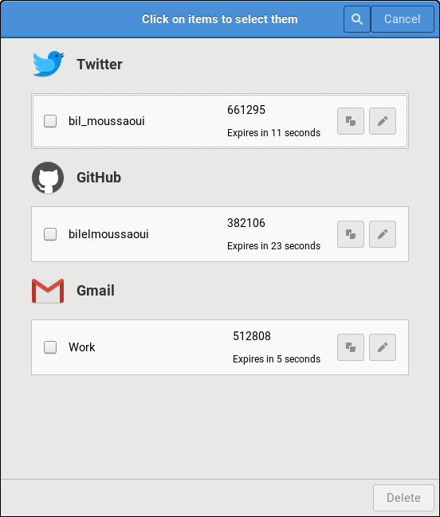
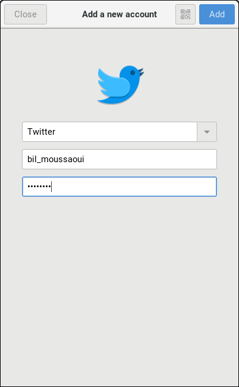
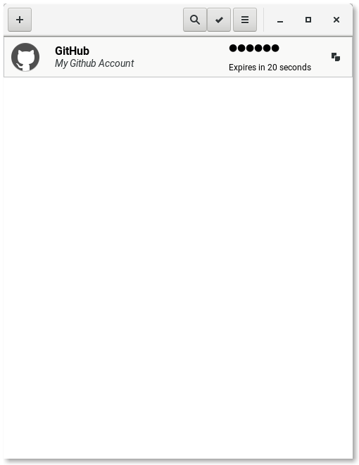

<a href="https://hosted.weblate.org/engage/Authenticator/?utm_source=widget"></a>  [](https://github.com/bilelmoussaoui/Authenticator/releases) 

# Authenticator

<p>Two-factor authentication code generator for Gnome. Created with love using Python and Gtk.</p>

### Dependecies

- `Python 3.3+`
- `Gtk 3.16+`
- `meson 0.38+`
- `ninja`
- `pyotp`
- `Pillow`
- `pyzbar` depends on `zbar`
  - `libzbar-dev` on Ubuntu
  - `zbar` on Arch
- `libsecret`
- `gnome-screenshot`

<sub>
PS: The application was only tested on Arch with Gtk 3.20+, but it should work nicely with older versions too. Keyboard shortcuts widget won't be shown for older versions.
</sub>

### Screenshots

 <br>


### Features

- QR code scanner
- Beautiful UI
- Huge database of (290+) websites/applications

### Credits

- Websites and application icons are from Paper theme, created by [Sam Hewitt](https://github.com/snwh)
- Applications/Websites database are from [Authenticator](https://github.com/2factorauth/Authenticator), by 2factorauth team

### How to build from source

1 - Clone the repository

```bash
git clone https://github.com/bilelmoussaoui/Authenticator && cd ./Authenticator
```

2 - Install Python dependecies

```bash
sudo pip install pyotp zbarlight pyaml Pillow meson ninja
```

<sub>PS : In some distributions you will need to use `pip3` instead of `pip` to install the compatible version of the package with Python 3.</sub> <br>

3 - Afterwards

```bash
meson builddir
sudo ninja -C builddir install
```

4 - You can run the application from the desktop file or from terminal using
```bash
authenticator
```

### Flags

- `--debug`
  Open the application with debug flags

- `--version`
  Shows the version number of the application

- `--about`
  Shows the about dialog
