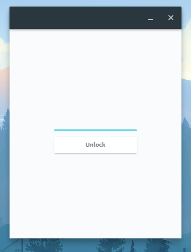
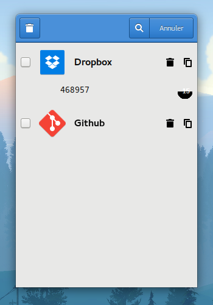

 [](https://github.com/bil-elmoussaoui/Gnome-TwoFactorAuth/releases) 

# Gnome TwoFactorAuth
Two-factor authentication code generator for Gnome <br>
### Dependecies
- `Python 3.3+`
- `Gtk 3.16+`
- `python-pyotp`
- `python-yaml`
- `python-pillow`
- `zbarlight` depends on `zbar`
    - `libzbar-dev` on Ubuntu
    - `zbar` on Arch
- `GnomeKeyring`
- `gnome-screenshot`

<sub>PS: The application was only tested on Arch with Gtk 3.20+, but it should work nicely with older versions too. Keyboard shortcuts widget won't be shown for older versions.</sub>

### Screenshots

  

### Features
- QR code scanner
- Beautiful UI
- Handy shortcuts
- Huge database of (290+) websites/applications

### Installation
- On Arch :
```bash
    yaourt -S gnome-twofactourauth
```

### Credits
- Websites and application icons are from Paper theme, created by [Sam Hewitt](https://github.com/snwh)
- Applications/Websites database are from [twofactorauth](https://github.com/2factorauth/twofactorauth), by 2factorauth team

### How to build from source
1 - Clone the repository
```bash
    git clone https://github.com/bil-elmoussaoui/TwoFactorAuth && cd ./TwoFactorAuth
```
2 - Install `python-pyotp`
```bash
    sudo pip install pyotp
```
3 - Install `zbarlight`
```bash
sudo pip install zbarlight
```
4 - Install `python-yaml`
```bash
sudo pip install pyyaml
```
5 - Install `python-pillow`
```bash
sudo pip install pillow
```

<sub>PS : In some distributions you will need to use `pip3` instead of `pip` to install the compatible version of the package with Python 3.</sub> <br>
6 - Afterwards
```bash
    ./autogen.sh
    make
    sudo make install
```
7 - You can run the application from the desktop file or from terminal using
```bash
    gnome-twofactorauth
```
<sub>Arch users can build from source directly using AUR `yaourt -S gnome-twofactorauth-git`</sub>

### Flags
- `--debug` <br/>
    Open the application with debug flags
- `--version`<br/>
    Shows the version number of the application
- `--about`<br/>
    Shows the about dialog
